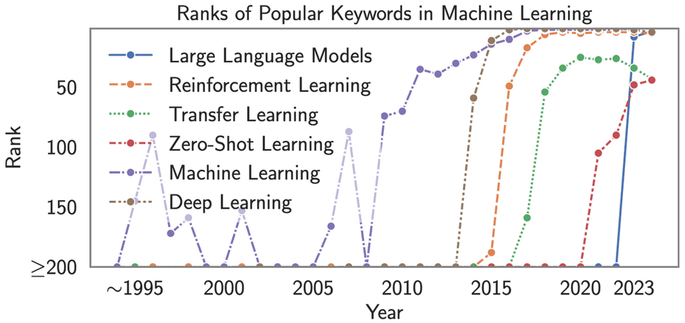
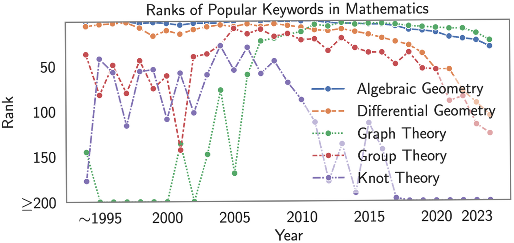

# 🎓 SciEvo: A Longitudinal Scientometric Dataset

### <p style="color:rgb(255,0,0);">Best Paper Award at the <a href="https://sites.google.com/servicenow.com/good-data-2025/program?authuser=0"> 1st Workshop on Preparing Good Data for Generative AI: Challenges and Approaches (Good-Data @ AAAI 2025)</a></p>

**SciEvo** is a large-scale dataset that spans over **30 years of academic literature** from arXiv, designed to support scientometric research and the study of scientific knowledge evolution. By providing a comprehensive collection of **over two million publications**, including detailed metadata and citation graphs, SciEvo enables researchers to analyze long-term trends in academic disciplines, citation practices, and interdisciplinary knowledge exchange.

 <a href="https://github.com/Ahren09/SciEvo.git">GitHub</a>｜ <a href="https://huggingface.co/datasets/Ahren09/SciEvo">HuggingFace</a> |  <a href="https://www.kaggle.com/datasets/ahren09/scievo">Kaggle</a> | 📄 <a href="https://arxiv.org/abs/2410.09510">Paper</a>

<a href="https://arxiv.org/abs/2410.09510"></a> <br>

## 📋 Table of Contents

- [Installation](#installation)
- [Quick Start](#quick-start)
- [Dataset Overview](#dataset-overview)
- [Usage Examples](#usage-examples)
- [API Reference](#api-reference)
- [Research Applications](#research-applications)
- [Example Findings](#example-findings)
- [Visualizations](#visualizations)
- [Contributing](#contributing)
- [Citation](#citation)
- [License](#license)

## 🚀 Installation

### Prerequisites

- Python 3.8+
- pip

### Install from Source

```bash
# Clone the repository
git clone https://github.com/Ahren09/SciEvo.git
cd SciEvo

# Install dependencies
pip install -r requirements.txt
```

### Install from PyPI (Coming Soon)

```bash
pip install scievo
```

## ⚡ Quick Start

### Basic Usage

```python
from datasets import load_dataset

# Load the SciEvo dataset
dataset = load_dataset("Ahren09/SciEvo")

# Access different configurations
arxiv_data = dataset["arxiv"]
semantic_scholar_data = dataset["semantic_scholar"]
references_data = dataset["references"]

# Explore the data
print(f"Number of arXiv papers: {len(arxiv_data)}")
print(f"Number of Semantic Scholar papers: {len(semantic_scholar_data)}")
print(f"Number of reference entries: {len(references_data)}")
```

### Running Analysis Scripts

```bash
# Citation analysis
python analysis/analyze_citation.py

# Keyword extraction
python analysis/keyword_extraction_llm.py --feature_name title

# Visualization
python visualization/plot_aoc_by_subjects.py
```

## 📊 Dataset Overview

### Key Features

- **Longitudinal Coverage:** Includes academic publications from arXiv since **1991**
- **Rich Metadata:** Titles, abstracts, full texts, keywords, subject categories, and citation relationships
- **Comprehensive Citation Graphs:** Captures citation networks to analyze influence and knowledge diffusion
- **Interdisciplinary Focus:** Supports cross-disciplinary studies on research evolution and knowledge exchange
- **Analytical and Visualization Tools:** Provides tools for analyzing terminology shifts, citation dynamics, and paradigm shifts
- **Ease of usage:** SciEvo is ready-to-use. You can directly download the dataset from HuggingFace, instead of downloading from [arXiv API](https://arxiv.org/) or [S2ORC](https://www.semanticscholar.org/), which can be costly and requires API keys

### Dataset Components

#### Semantic Scholar Data

| Field | Description |
|-------|-------------|
| `paperId` | The Semantic Scholar ID for the paper |
| `externalIds` | Dictionary containing other external identifiers (DOI, PubMed ID, etc.) |
| `title` | The title of the paper |
| `abstract` | A summary of the paper's content |
| `year` | The year the paper was published |
| `citationCount` | Number of times this paper has been cited |
| `influentialCitationCount` | Number of "influential" citations by Semantic Scholar's algorithms |
| `fieldsOfStudy` | List of general research fields |
| `s2FieldsOfStudy` | More granular classification of research fields |
| `arXivId` | Identifier for the paper in arXiv repository |

#### arXiv Paper Data

| Field | Description |
|-------|-------------|
| `id` | The paper's arXiv ID |
| `title` | The title of the paper |
| `summary` | The abstract or summary of the paper |
| `published` | Date when the paper was first published on arXiv |
| `authors` | List of authors who contributed to the paper |
| `tags` | Set of subject categories (e.g., `cs.AI`) |
| `title_keywords` | Keywords extracted from the title |
| `title_and_abstract_keywords` | Keywords extracted from both title and abstract |

#### Citation Graph (References)

| Field | Description |
|-------|-------------|
| `arXivId` | The paper's arXiv ID |
| `references` | List of references cited by the paper |
| `arXivPublicationDate` | Date when the paper was first published on arXiv |

## 🔧 Usage Examples

### Citation Analysis

```python
# Analyze citation patterns and age of citations
python analysis/analyze_citation.py --feature_name title
```

### Keyword Extraction

```python
# Extract keywords using LLM
python analysis/keyword_extraction_llm.py --feature_name title

# Extract keywords for specific years
python analysis/keyword_extraction_llm.py --year 2020

# Extract keywords from title and abstract
python analysis/keyword_extraction_llm.py --feature_name title_and_abstract
```

### Visualization

```python
# Plot Age of Citation (AoC) by subjects
python visualization/plot_aoc_by_subjects.py

# Plot citation diversity
python visualization/plot_citation_diversity.py --feature_name title

# Plot keyword trajectories
python visualization/plot_keyword_traj.py
```

## 📚 API Reference

### Analysis Scripts

#### Citation Analysis
- `analysis/analyze_citation.py` - Analyze citation patterns and diversity
- `analysis/rank_keywords_by_number_of_occurrences.py` - Rank keywords by frequency

#### Keyword Extraction
- `analysis/keyword_extraction.py` - Traditional keyword extraction
- `analysis/keyword_extraction_llm.py` - LLM-based keyword extraction
- `analysis/keyword_extraction_ngram.py` - N-gram based extraction

### Dataset Processing
- `dataset/construct_citation_graph.py` - Build citation networks
- `dataset/construct_keyword_hypergraph.py` - Create keyword hypergraphs
- `dataset/download_arxiv_paper.py` - Download arXiv papers

### Models
- `model/gcn.py` - Graph Convolutional Network models
- `model/gconvgru.py` - GConvGRU models
- `model/word2vec.py` - Word embedding models
- `model/procrustes.py` - Alignment analysis

### Visualization
- `visualization/plot_aoc_by_subjects.py` - Age of Citation plots
- `visualization/plot_citation_diversity.py` - Citation diversity analysis
- `visualization/plot_keyword_traj.py` - Keyword trajectory visualization

### Command Line Arguments

Most scripts support the following arguments:
- `--feature_name title` - Focus analysis on paper titles only
- `--feature_name title_and_abstract` - Include abstract text in analysis
- `--year` - Specify year for temporal analysis
- `--gcn` - Use Graph Convolutional Network models
- `--model` - Specify model type (e.g., "7b")
- `--networkx` - Use NetworkX for graph operations

## 🔬 Research Applications

SciEvo enables researchers to explore **scientific knowledge evolution** and **citation patterns** with a broad range of applications:

- **Terminology Evolution:** Tracking the rise and decline of key terms over time
- **Citation Dynamics:** Understanding citation lifespan and field-specific differences
- **Interdisciplinary Research Patterns:** Analyzing how different disciplines interact
- **Scientific Paradigm Shifts:** Identifying major shifts in research focus
- **Comparative Field Analysis:** Exploring differences in knowledge production and citation behavior across disciplines

## 📈 Example Findings

Using SciEvo, we uncover key insights into the evolution of scientific research:

- **Paradigm Shifts:** Scientific progress occurs in leaps rather than through gradual accumulation. Applied fields, such as LLM research, show rapid shifts
- **Keyword Trends:** Machine learning terms surged post-2015, reflecting the growing dominance of AI-related research
- **Citation Lifespan:** Applied fields exhibit shorter citation cycles (e.g., **LLM research: 2.48 years**, **Oral History: 9.71 years**), indicating recency bias in some disciplines
- **Disciplinary Homophily:** Over **91% of citations occur within the same discipline**, showing strong field-specific citation preferences
- **Epistemic Cultures:** Applied research relies on recent works, whereas theoretical fields prioritize foundational literature

## 🎨 Visualizations

### Citation Graphs


Citation graphs of papers related to LLMs and COVID.

### Keyword Trajectories


Keyword trajectories of the term **Artificial Intelligence** and **COVID-19** show how these keywords co-occur with other keywords in papers.

### Keyword Evolution




Evolution in the ranks of math and machine-learning terms among all keywords over time. Math keywords remain consistently popular but show a decline in the past decade, while ML keywords surged in prominence over the last ten years.

### Cross-Disciplinary Citations


The figure above shows the distribution of Citations in the SciEvo dataset, which exhibits higher intra-disciplinary (within identical subject areas) than cross-disciplinary citations.

### Age of Citations


Age of Citation (AoC) across the 8 arXiv subjects shows distinct trends. eess and cs exhibit left-skewed distributions, indicating a preference towards recent citation. In contrast, disciplines such as physics, math, and econ demonstrate broader AoCs, reflecting their reliance on historical foundational research.

## 🤝 Contributing

We welcome contributions! Please see our [Contributing Guidelines](CONTRIBUTING.md) for details.

### Development Setup

```bash
# Clone the repository
git clone https://github.com/Ahren09/SciEvo.git
cd SciEvo

# Install in development mode
pip install -e .

# Run tests
python -m pytest tests/
```

## 📖 Citation

If you use SciEvo in your research, please cite our work:

```bibtex
@article{jin2024scito2m,
  title={SciEvo: A 2 Million, 30-Year Cross-disciplinary Dataset for Temporal Scientometric Analysis},
  author={Jin, Yiqiao and Xiao, Yijia and Wang, Yiyang and Wang, Jindong},
  journal={arXiv:2410.09510},
  year={2024}
}
```

## 📁 Project Structure

```
SciEvo/
├── analysis/                # Analytical tools and experiments
├── dataset/                 # Dataset storage and processing
├── model/                   # Models for citation analysis and topic modeling
├── visualization/           # Code and tools for visualization
├── utility/                 # Utility scripts for data processing
├── notebooks/               # Jupyter notebooks for analysis and experiments
├── outputs/                 # Results from analysis
│   ├── citation_analysis/   # Citation trend insights
│   ├── stats/               # Statistical summaries
│   └── visual/              # Visualization outputs
├── checkpoints/             # Model checkpoints
├── representations/         # Embedding and vector representations
└── embed/                   # Embedding-related scripts
```

## 📚 About arXiv Taxonomy

arXiv has a comprehensive taxonomy that categorizes research papers into broadly 8 fields, including Computer Science (cs), Economics (econ), Electrical Engineering and Systems Science (eess), Mathematics (math), Physics, Quantitative Biology (q-bio), Quantitative Finance (q-fin), and Statistics (stats).

Within Computer Science, there are several subfields, each dedicated to specific areas of research and innovation. For example, Artificial Intelligence (cs.AI), Machine Learning (cs.ML), Computer Vision (cs.CV), etc.

More information can be found in **[arXiv Submission Taxonomy](https://arxiv.org/category_taxonomy)**.

## 📄 License

SciEvo is released under the [**Apache 2.0 License**](https://www.apache.org/licenses/LICENSE-2.0).

---

This repository contains the bibliographic data for all the arXiv papers released until April 21st. 


