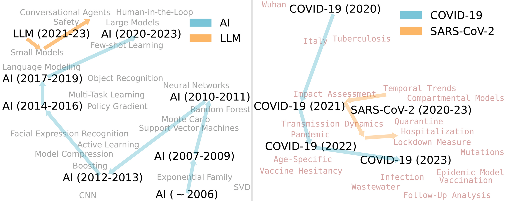
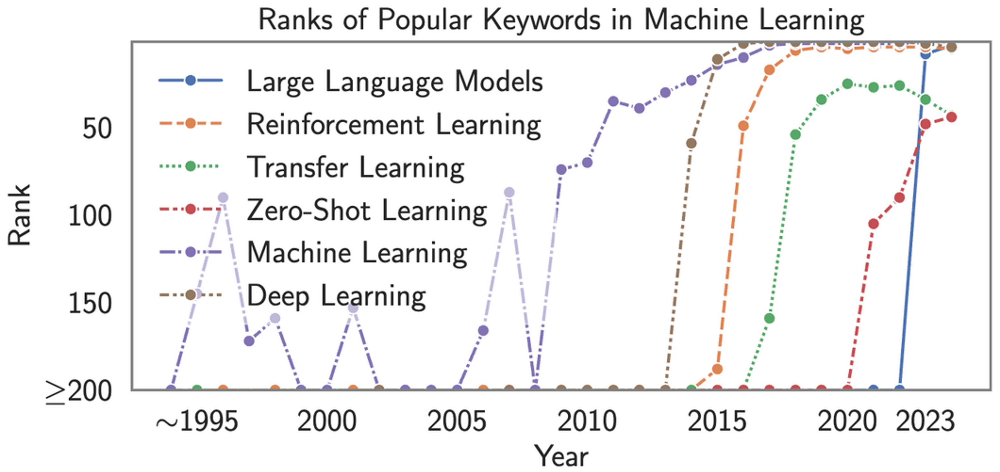
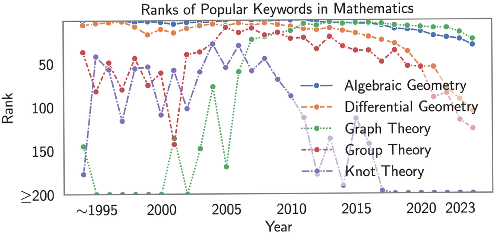
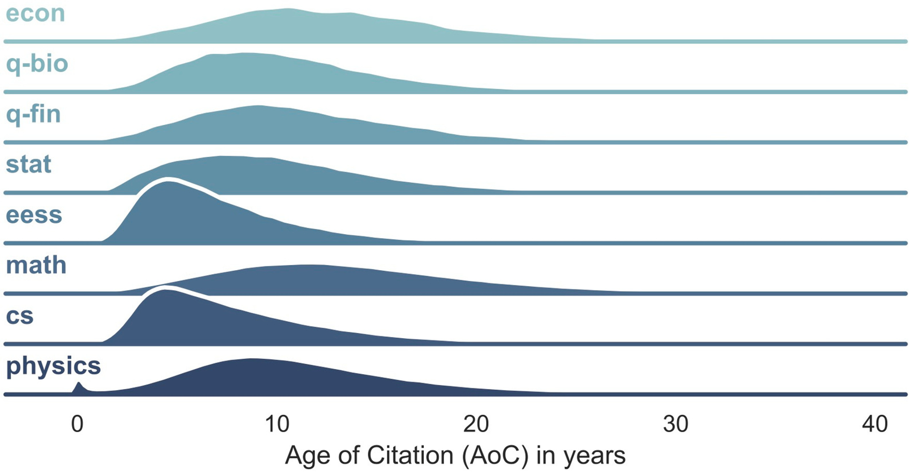

# 🎓 SciEvo: A Longitudinal Scientometric Dataset

### <p style="color:rgb(255,0,0);">Best Paper Award at the <a href="https://sites.google.com/servicenow.com/good-data-2025/program?authuser=0"> 1st Workshop on Preparing Good Data for Generative AI: Challenges and Approaches (Good-Data @ AAAI 2025)</a></p>

**SciEvo** is a large-scale dataset that spans over **30 years of academic literature** from arXiv, designed to support scientometric research and the study of scientific knowledge evolution. By providing a comprehensive collection of **over two million publications**, including detailed metadata and citation graphs, SciEvo enables researchers to analyze long-term trends in academic disciplines, citation practices, and interdisciplinary knowledge exchange.

 <a href="https://github.com/Ahren09/SciEvo.git">GitHub</a>｜ <a href="https://huggingface.co/datasets/Ahren09/SciEvo">HuggingFace</a> |  <a href="https://www.kaggle.com/datasets/ahren09/scievo">Kaggle</a> | 📄 <a href="https://arxiv.org/abs/2410.09510">Paper</a>

<a href="https://arxiv.org/abs/2410.09510"></a> <br>

## Citation
If you use SciEvo in your research, please cite our work:
```
@article{jin2024scito2m,
  title={SciEvo: A 2 Million, 30-Year Cross-disciplinary Dataset for Temporal Scientometric Analysis},
  author={Jin, Yiqiao and Xiao, Yijia and Wang, Yiyang and Wang, Jindong},
  journal={arXiv:2410.09510},
  year={2024}
}
```

## Key Features
- **Longitudinal Coverage:** Includes academic publications from arXiv since **1991**.
- **Rich Metadata:** Titles, abstracts, full texts, keywords, subject categories, and citation relationships.
- **Comprehensive Citation Graphs:** Captures citation networks to analyze influence and knowledge diffusion.
- **Interdisciplinary Focus:** Supports cross-disciplinary studies on research evolution and knowledge exchange.
- **Analytical and Visualization Tools:** Provides tools for analyzing terminology shifts, citation dynamics, and paradigm shifts.
- **Ease of usage**: SciEvo is ready-to-use. You can directly download the dataset from HuggingFace, instead of downloading from [arXiv API](https://arxiv.org/) or [S2ORC](https://www.semanticscholar.org/), which can be costly and requires API keys.

## Dataset Features


### Semantic Scholar

- **paperId**: The Semantic Scholar ID for the paper.
- **externalIds**: A dictionary containing other external identifiers such as DOI, PubMed ID, etc.
- **corpusId**: An internal identifier used by Semantic Scholar.
- **publicationVenue**: The name of the journal, conference, or workshop where the paper was published.
- **url**: The URL link to the paper on Semantic Scholar.
- **title**: The title of the paper.
- **abstract**: A summary of the paper’s content.
- **venue**: Another reference to the publication venue, which might contain variations of the `publicationVenue` field.
- **year**: The year the paper was published.
- **referenceCount**: The number of references cited in the paper.
- **citationCount**: The number of times this paper has been cited by others.
- **influentialCitationCount**: The number of citations that are considered "influential" by Semantic Scholar’s algorithms. Check this article: *[What are Highly Influential Citations?](https://www.semanticscholar.org/faq/influential-citations#:~:text=Influential%20citations%20are%20determined%20utilizing,in%20%E2%80%9CIdentifying%20Meaningful%20Citations%E2%80%9D.)*
- **isOpenAccess**: A boolean flag indicating whether the paper is available as open access.
- **openAccessPdf**: The URL link to the open-access PDF version of the paper (if available).
- **fieldsOfStudy**: A list of general research fields to which the paper belongs.
- **s2FieldsOfStudy**: A more granular classification of research fields used by Semantic Scholar.
- **publicationTypes**: The type of publication (e.g., journal article, conference paper, preprint, etc.).
- **semanticScholarPublicationDate**: The official publication date recorded by Semantic Scholar.
- **journal**: The journal where the paper was published (if applicable).
- **citationStyles**: Various citation formats for referencing the paper.
- **authors**: A list of authors who contributed to the paper.
- **arXivPublicationDate**: The date the paper was first published on arXiv (if applicable).
- **arXivId**: The identifier for the paper in the arXiv repository (if available).

### arXiv Paper

The `arxiv_data` dataframe contains the following features:

- **id**: The paper's arXiv ID.
- **title**: The title of the paper.
- **summary**: The abstract or summary of the paper.
- **arxiv_comment**: Comments from the authors, (e.g. `Accepted at ICML 2025`).
- **published**: The date when the paper was first published on arXiv.
- **updated**: The date when the paper was last updated on arXiv.
- **authors**: A list of authors who contributed to the paper.
- **tags**: A set of subject categories associated with the paper, e.g. `cs.AI`
- **tags_cleaned**: Processed or cleaned version of the `tags` field.
- **title_keywords**: Keywords extracted from the title.
- **title_and_abstract_keywords**: Keywords extracted from both the title and abstract.

### Citation Graph (References)

- **arXivId**: The paper's arXiv ID.
- **references**: A list of references cited by the paper, including metadata such as fields of study and citation information.
- **arXivPublicationDate**: The date when the paper was first published on arXiv.

## Project Structure
```
SciEvo/
├── notebooks/               # Jupyter notebooks for analysis and experiments
├── dataset/                 # Dataset storage
│   ├── data/                # Raw and processed data files
│   └── outputs/             # Processed outputs and intermediate results
├── model/                   # Models for citation analysis and topic modeling
├── utility/                 # Utility scripts for data processing
│   └── __pycache__/         # Cached Python modules
├── data/                    # Additional data resources
│   └── additional_data/     # Supplementary data sources
│       ├── categories/      # Subject category classifications
│       ├── categories_keywords/ # Keywords extracted from categories
│       └── conferences/     # Conference-related datasets
├── outputs/                 # Results from analysis
│   ├── citation_analysis/   # Citation trend insights
│   ├── stats/               # Statistical summaries
│   └── visual/              # Visualization outputs
│       ├── AoC/             # Age of citation analysis
│       ├── keyword_ranks/   # Keyword ranking over time
│       ├── keyword_trajectories/ # Evolution of key research terms
│       └── bak/             # Backup files
├── checkpoints/             # Model checkpoints
│   ├── title_and_abstract_llm_extracted_keyword/
│   │   ├── gcn/             # Graph Convolutional Network (GCN) models
│   │   └── word2vec/        # Word2Vec-based keyword extraction
│   └── title_llm_extracted_keyword/
│       ├── gcn/
│       └── word2vec/
├── demo/                    # Demo datasets and outputs
├── representations/         # Embedding and vector representations of papers
├── visualization/           # Code and tools for visualization
├── embed/                   # Embedding-related scripts
│   └── __pycache__/
└── analysis/                # Analytical tools and experiments
```

## Research Applications
SciEvo enables researchers to explore **scientific knowledge evolution** and **citation patterns** with a broad range of applications:
- **Terminology Evolution:** Tracking the rise and decline of key terms over time.
- **Citation Dynamics:** Understanding citation lifespan and field-specific differences.
- **Interdisciplinary Research Patterns:** Analyzing how different disciplines interact.
- **Scientific Paradigm Shifts:** Identifying major shifts in research focus.
- **Comparative Field Analysis:** Exploring differences in knowledge production and citation behavior across disciplines.

## Example Findings
Using SciEvo, we uncover key insights into the evolution of scientific research:
- **Paradigm Shifts:** Scientific progress occurs in leaps rather than through gradual accumulation. Applied fields, such as LLM research, show rapid shifts.
- **Keyword Trends:** Machine learning terms surged post-2015, reflecting the growing dominance of AI-related research.
- **Citation Lifespan:** Applied fields exhibit shorter citation cycles (e.g., **LLM research: 2.48 years**, **Oral History: 9.71 years**), indicating recency bias in some disciplines.
- **Disciplinary Homophily:** Over **91% of citations occur within the same discipline**, showing strong field-specific citation preferences.
- **Epistemic Cultures:** Applied research relies on recent works, whereas theoretical fields prioritize foundational literature.

## Getting Started
1. **Clone the Repository:**
   ```bash
   git clone https://github.com/Ahren09/SciEvo.git
   cd SciEvo
   ```
2. **Set Up Dependencies:**
   Install necessary Python libraries with:
   ```bash
   pip install -r requirements.txt
   ```
3. **Explore the Dataset:**
   - Data is available in 🤗 dataset [`Ahren09/SciEvo`](https://huggingface.co/datasets/Ahren09/SciEvo).
   - Preprocessed citation and keyword extraction results are in `outputs/`.
   - Jupyter notebooks in `notebooks/` contain example analyses.

4. **Downloading arXiv Papers**

- To download the PDFs of arXiv papers, you can use the functions in `dataset/download_arxiv_paper.py`. 
- Alternatively, arXiv provides bulk download using `s3cmd`. Refer to the [arXiv Bulk Data Access](https://info.arxiv.org/help/bulk_data.html) for more information.


## Sample Visualizations

We provide the scripts for visualizing the SciEvo dataset. Below are a few examples.


Citation graphs of papers related to LLMs and COVID.  



Keyword trajectories of the term **Artificial Intelligence** and **COVID-19** show how the these keywords co-occur with other keywords in papers (more details in the <a href="https://arxiv.org/abs/2410.09510">paper</a>).






Evolution in the ranks of math and machine-learning
terms among all keywords over time. Math keywords remain consistently popular but show a decline in the past decade, while ML keywords surged in prominence over the last ten years.


The figure above shows the distribution of Citations in the SciEvo dataset, which exhibits higher intra-disciplinary (within identical subject areas) than cross-disciplinary citations.



Age of Citation (AoC) across the 8 arXiv subjects shows distinct trends. eess and cs exhibit left-skewed distributions, indicating a preference towards recent citation. In contrast, disciplines such as physics, math, and econ demonstrate broader AoCs, reflecting their reliance on historical foundational research.


## License
SciEvo is released under the [**Apache 2.0 License**](https://www.apache.org/licenses/LICENSE-2.0). 


This repository contains the bibliographic data for all the arXiv papers released until April 21st. 

## About [arXiv Taxonomy](https://arxiv.org/category_taxonomy)

arXiv has a comprehensive taxonomy that categorizes research papers into broadly 8 fields, including Computer Science (cs), Economics (econ), Electrical Engineering and Systems Science (eess), Mathematics (math), Physics, Quantitative Biology (q-bio), Quantitative Finance (q-fin), and  Statistics (stats).

Within Computer Science, there are several subfields, each dedicated to specific areas of research and innovation. For example, Artificial Intelligence (cs.AI),Machine Learning (cs.ML), Computer Vision (cs.CV), etc.

More information can be found in **[arXiv Submission Taxonomy](https://arxiv.org/category_taxonomy)**.


